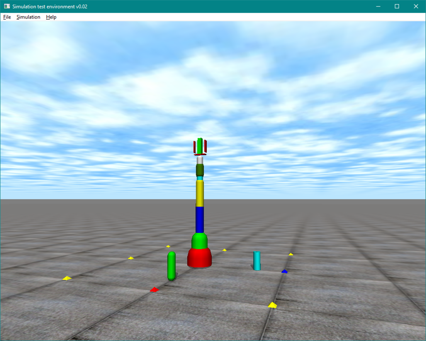

# Robot Arm Projects Repository
A robot arm simulator project using Open Dynamics Engine (ODE)

It is the robot arm simulator simulating a standard industrial robot arm.
It consists of an anthropomorphic arm and a spherical wrist (6 revolute joints)

## Dependency
- Open Dynamics Engine (ODE 0.15.2). See the [website](http://opende.sourceforge.net/wiki/index.php/Main_Page) for installation instruction.
- Eigen 3.3.5. See the [website](http://eigen.tuxfamily.org) for installation instruction.

## Installation
CMakeLists file is included in the project. So just run cmake to create the projects. Two projects will be created:

- robotlib: basic robot math and utility library
- robotarm_app: main project running the simulation

## Simulation
After compiling the projects, the simulation will run like this: 

### Controls
Currently, the simulator uses keyboard to control the robot arm pose. Here is the list of the keys:
- **z**: change control model
  - mode 0: direct joint controls
  - mode 1: tooltip controls along the global coordinate system
  - mode 2: tooltip controls along the local tool coordinate system
- **u**: gripper toggle

#### Direct Joint Control Mode  
- **q**: increase angle of the base joint
- **a**: decrease angle of the base joint
- **w**: increase angle of the shoulder joint
- **s**: decrease angle of the shoulder joint
- **e**: increase angle of the elbow joint
- **d**: decrease angle of the elbow joint
- **r**: increase angle of the elbow rotation joint
- **f**: decrease angle of the elbow rotation joint
- **t**: increase angle of the wrist flexion joint
- **g**: decrease angle of the wrist flexion joint
- **y**: increase angle of the wrist rotation joint
- **h**: decrease angle of the wrist rotation joint

#### Global Tooltip Control Mode
- **q**: increase translation along global x axis
- **a**: decrease translation along global x axis
- **w**: increase translation along global y axis
- **s**: decrease translation along global y axis
- **e**: increase translation along global z axis
- **d**: decrease translation along global z axis

#### Local Tooltip Control Mode
- **q**: increase translation along local x axis
- **a**: decrease translation along local x axis
- **w**: increase translation along local y axis
- **s**: decrease translation along local y axis
- **e**: increase translation along local z axis
- **d**: decrease translation along local z axis
